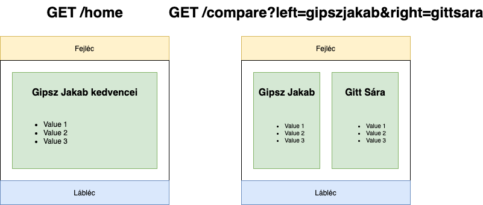
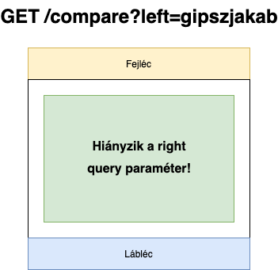

# 2020. február 06., csütörtök

[előző alkalom](../20200130) [következő alkalom](../2020206)

# Express vs. Handlebars

- Express: webszerver
- Handlebars: sablonkezelő alrendszer (template engine)
- Az Expressbe integrálhatunk különböző template engineket

https://expressjs.com/en/guide/using-template-engines.html

# Mi az a template engine?

- String interpoláció extrákkal
- Értékek behelyettesítése
- Komplett oldalak, oldalrészletek újrafelhasználható kezelése

https://expressjs.com/en/guide/using-template-engines.html

- Handlebars önálló használata: https://handlebarsjs.com/installation/#npm-or-yarn-recommended
- Handlebars a kliensoldalon
- Handlebars a szerveroldalon

# Alapvető handlebars funkciók

https://handlebarsjs.com/guide/

# Gyakorlat: handlebars hello world

Írjunk egy egyszerű weboldalt, amely egy Handlebars templateből írja ki, hogy `hello world`.

Egyelőre ne használjuk az `express-handlebars` modult!

# Gyakorlat: handlebars hello ${user}

Írjunk egy egyszerű weboldalt, amely egy Handlebars template felhasználásával írja ki, hogy `hello ${name}`, ahol a `name` változó egy query paraméterből kap értéket az oldal betöltésekor.

Egyelőre ne használjuk az `express-handlebars` modult!

# Gyakorlat: visit count

Írjunk egy egyszerű weboldalt, amely egy Handlebars template felhasználásával írja ki, hogy `hello ${name}`, ahol a `name` változó egy query paraméterből kap értéket az oldal betöltésekor.

Egyelőre ne használjuk az `express-handlebars` modult!

# Express template engine integráció

https://hackersandslackers.com/handlebars-templates-expressjs/

https://github.com/ericf/express-handlebars

# Gyakorlat: multipage

Írjunk három oldalból álló weboldalt.

Legyen mindhárom oldal egy-egy handlebar templateben leírva.

# Gyakorlat: layoutok

Írjunk egy két oldalból álló weboldalt `express-handlebars` használatával.

Az egy egyoszlopos layout és egy
oldalsávos navigációs layout.

Az egyoszlopos layout esetén a navigáció a fejléc alatt van.

Az oldalsávos layout esetén a navigáció egy oldalsávban van.

Legyen a fejléc és a lábléc egy-egy partiallal implementálva.

átirányítás (http redirect): https://expressjs.com/en/4x/api.html#res.redirect

# Házi: multipage

> Képernyőnként 1 pont
> - home
> - compare
> - error
>
> Partialok használata: 1 pont
>
> Layoutok használata: 1 pont

Készítsünk több oldalból álló weboldalt `express-handlebars` segítségével.

Legyen egy `/me` és egy `/compare` oldal.

A fejléc és a lábléc közös, ezek legyenek egy-egy partialként implementálva.

A `/me` oldalon a kedvenc dolgainkat soroljuk fel.

A `/compare` oldalon két személy kedvenceit jelenítjük meg kétoszlopos elrendezésben.

Ha az oldalnak átadtunk query paraméterként egy `left` és egy `right` értéket, egy a
webszerver memóriájában tárolt változóból olvassuk ki a megfelelő személyhez
tartozó adatokat.

Ha valamelyik paraméter hiányzik, a kétoszlopos elrendezés helyett egy egyoszlopos
nézet jelenik meg, amely tájékoztat a hiányzó paraméterről.

